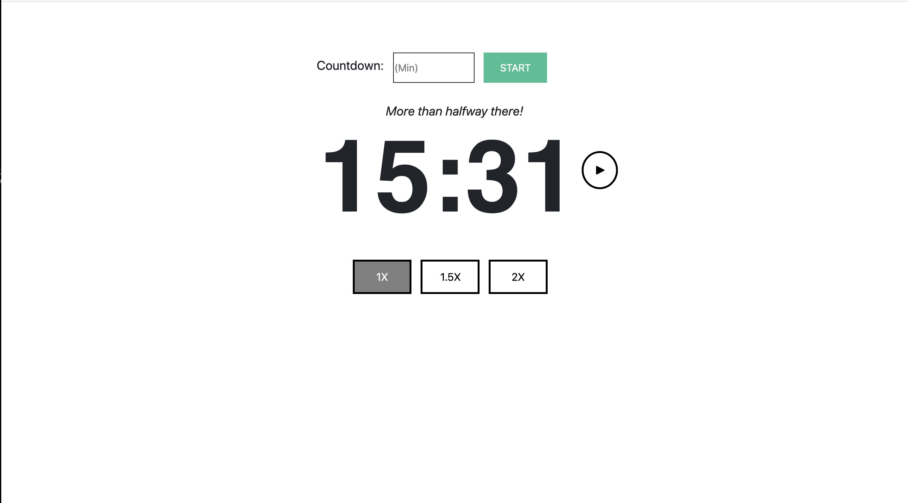
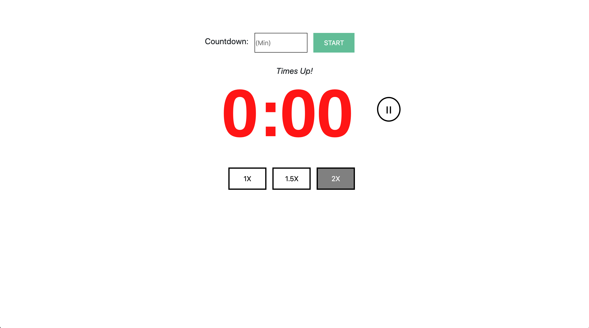

<h1>Ultimate Timer</h1>

  This is a timer app and it operates by allowing the user ti put in a duration of time 
  that they would like the timer to run for and pressing start. 
  
  Some cool features of it are that it:
  1. Can be paused and stopped.
  2. Can run a different speeds.
  3. Will notify the user of half time past. 
  4. Will change timer color and blink based on how close you 
      are to the end. 
      
  Developed Using FireFox.

 

<h1>EXAMPLES</h1>  

<h3>Halfway:</h3>

 
 
<h3>Times Up:</h3>

